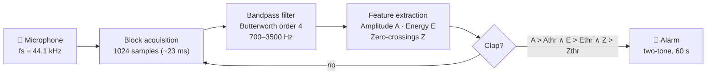

# 👏 Real-Time Hand Clap Detection

<p align="center">
  <em>Classical DSP pipeline for detecting impulsive hand claps in real time — no machine learning required.</em>
</p>

<p align="center">
  
  
  
  
</p>

---

## 📖 Overview

This project implements a **complete real-time audio processing chain** that detects hand claps using only classical signal processing techniques (no deep learning). It captures audio from a microphone, filters it through a stateful Butterworth bandpass filter, and applies a **multi-criteria decision algorithm** combining amplitude, energy, and zero-crossing rate — with an adaptive noise threshold for robustness.

When a clap is detected, a two-tone alarm is triggered automatically.

> Built as a Signal Processing project at **École de Physique Appliquée et d'Ingénierie, Université Mohammed VI Polytechnique (UM6P)**, 2026.

## ⚙️ How It Works



The system runs five stages on every 1024-sample audio block:

1. **Acquisition** — the microphone stream is sampled at 44.1 kHz and processed in blocks of 1024 samples (~23 ms), a size chosen to match the 5–50 ms duration of a clap.
2. **Filtering** — a 4th-order Butterworth bandpass keeps only the 700–3500 Hz band, where clap energy lives. Speech and ventilation hum fall below the band, whistles and hiss above it. The filter is *stateful*: its internal state is carried from block to block so no discontinuities appear at block boundaries.
3. **Feature extraction** — three complementary descriptors are computed per block: the peak **amplitude** `A` (impulse strength), the mean **energy** `E` (distinguishes a real clap from an isolated electrical click), and the **zero-crossing count** `Z` (a high-frequency content indicator).
4. **Decision** — a block is flagged as a clap only if all three conditions hold simultaneously. The amplitude threshold is *adaptive*: it tracks the ambient noise level via exponential smoothing, so the detector works in quiet rooms and noisy ones alike.
5. **Alarm** — on detection, a two-tone alarm plays for 60 s in a separate thread, with a 0.4 s cooldown to prevent double triggers (the microphone is ignored while the alarm sounds).
 
**Why this band?** A hand clap is an impulsive event (5–50 ms) whose energy concentrates between ~700 Hz and 3.5 kHz. The bandpass filter rejects speech and ventilation noise below the band and hiss above it, so the three descriptors cleanly separate claps from background.

## ✨ Key Features

- **Real-time processing** — 1024-sample blocks at 44.1 kHz (~23 ms), with measured per-block latency of **1.8 ms on PC** and **5.1 ms on Raspberry Pi 5**.
- **Stateful digital filtering** — the filter's internal state `zi` is propagated between audio blocks via `scipy.signal.lfilter_zi`, avoiding discontinuities in block-wise filtering.
- **Multi-criteria detection** — logical AND of amplitude, energy, and zero-crossing rate, each threshold justified by empirical distribution analysis.
- **Adaptive thresholding** — the amplitude threshold adapts to ambient noise via exponential smoothing (`α = 0.95`, safety factor `k = 6`).
- **Anti re-trigger logic** — 0.4 s cooldown between detections; microphone input ignored while the alarm plays.
- **Built-in offline evaluation** — precision / recall / F1 against a manually annotated ground truth (150 ms matching tolerance).
- **Cross-platform** — Windows, Linux, and Raspberry Pi via `python-sounddevice` (PortAudio).

## 🚀 Getting Started

### Prerequisites

- Python 3.10+
- A working microphone
- PortAudio (bundled on Windows/macOS; on Linux: `sudo apt install libportaudio2`)

### Installation

```bash
git clone [https://github.com/](https://github.com/)<your-username>/clap-detector.git
cd clap-detector
pip install numpy scipy sounddevice
```

### Usage

**Real-time detection** (start it, then clap near your microphone):

```bash
python clap_detector.py
```

**Offline evaluation** on a WAV file with annotated clap timestamps:

```bash
python clap_detector.py --evaluate recording.wav --gt 1.0 2.4 3.1 4.8
```

## 🎛️ Parameters

| Parameter | Default | Description |
|---|---|---|
| `fs` | 44 100 Hz | Sampling rate |
| `block_size` | 1024 | Samples per block (~23 ms) |
| `lowcut` / `highcut` | 700 / 3500 Hz | Bandpass cutoffs |
| `filter_order` | 4 | Butterworth order (maximally flat) |
| `amplitude_threshold` | 0.12 | Min amplitude `A` |
| `energy_threshold` | 0.002 | Min mean energy `E` |
| `zc_threshold` | 30 | Min zero-crossings `Z` |
| `cooldown_s` | 0.4 s | Anti-double-detection delay |
| `alarm_duration_s` | 60 s | Alarm duration |
| `adaptive` / `adaptive_k` | True / 6.0 | Adaptive noise threshold |
| `noise_alpha` | 0.95 | Noise smoothing coefficient |

## 📊 Results

Evaluation on 150 real claps across three environmental conditions (50 per condition):

| Condition | Precision | Recall | F1 |
|---|---|---|---|
| Silence | 1.000 | 1.000 | 1.000 |
| Background music | 0.940 | 0.940 | 0.940 |
| Background speech | 0.957 | 0.880 | 0.917 |
| **Global** | **0.966** | **0.940** | **0.953** |

| Platform | Mean latency | Max latency |
|---|---|---|
| PC (Intel i5) | 1.8 ms | 4.3 ms |
| Raspberry Pi 5 | 5.1 ms | 11.2 ms |

**Error analysis:** the few false positives come from impulsive sounds sharing a clap's spectro-temporal signature (door slams, object impacts); false negatives occur for distant claps or claps masked by simultaneous loud noise.


## 🔭 Limitations & Perspectives

- Detection is tuned for hand claps specifically; other impulsive sounds can trigger false positives.
- Thresholds were calibrated experimentally and may need adjustment for unusual acoustic setups.
- Possible extensions: spectrogram-based cross-correlation with a clap template, multi-microphone fusion, integration with home-automation (IoT) systems.

## 📚 References

- Oppenheim & Schafer, *Discrete-Time Signal Processing*, 3rd ed., Pearson, 2010.
- Cooley & Tukey, "An Algorithm for the Machine Calculation of Complex Fourier Series", *Math. Comp.*, 1965.
- Repp, "The sound of two hands clapping", *JASA*, 1987.
- [python-sounddevice documentation](https://python-sounddevice.readthedocs.io)

## 👥 Authors

- **Khawla Najmi**
- **Alex Lankoande**
- **Firdous Mabchour**
- **Ziad Ouahabi**

*Signal Processing project — École de Physique Appliquée et d'Ingénierie, UM6P, 2026.*

## 📄 License

This project is licensed under the MIT License — see the [LICENSE](LICENSE) file for details.
  
